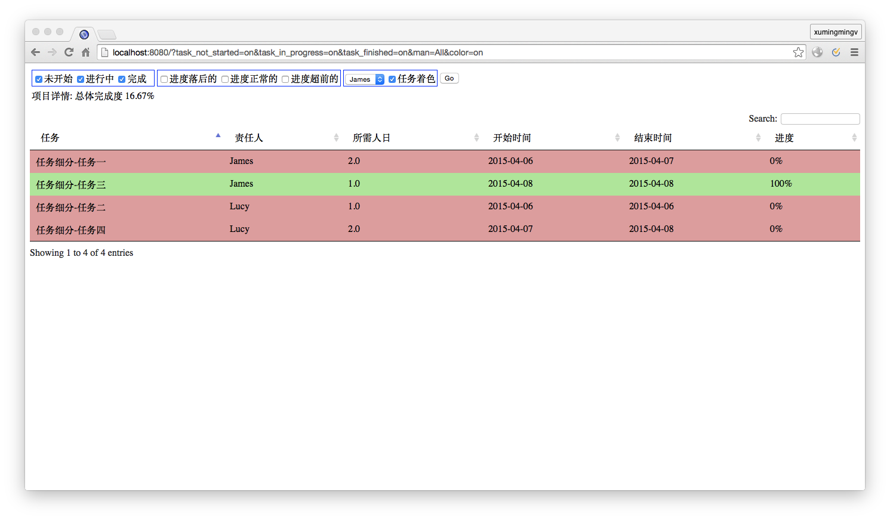

pyscheduler
===========

When we are in a project, we need to make plans, there are usually two ways to do it: The first is to use a software like `Microsoft Project`, this kind of software have rich features, but there is one downside which I don't like: they are too heavy, it is different to embbed the project plan into a text file like `Markdown` file; The second is to utilize the table syntax to write the plan directly in a markdown file. Personally I prefer the second approach: it is pure text, you do not rely on any special app to display it; It also has its downside, it is hard to maintain:

* If you want to change the scheduled time for on of the tasks, you need to re-schedule all the tasks after it.
* You can not see all the resource usage for the whole project like what `Microsoft Project` did.
* You cann't filter the tasks according to some perticually critera.

This tiny software is to solve the above issues.

## Currently we support the following features

* [Auto-Schedule](#usage)
* [Track task progress](#track-task-progress)
* [Filter by prople](#filter-by-people)
* [Trackvacation](#track-vacation)
* [Break big tasks](#break-big-tasks)
* [Scheduler UI](#scheduler-ui)


## Scheduler Command Line

### Basic Usage

```bash
scheduler.py [-m <man>] /path/to/work-breakdown-file.markdown
```

The input file for the command line tool is a `markdown` file(see test_en.markdown for an example), you can define the tasks of your project in a file, e.g.

```bash
# Task basic info
* 项目开始时间: 2014-08-21

# task breakdown
* task1 -- 2[James]
* task2 -- 1[Lucy]
* task3 -- 1[James]
* task4 -- 2[Lucy]
```

The above file defines that the project starts from `2014-08-21`, and defines the tasks of the project, now run the following command, we get an auto-scheduled project plan(If you use a Fixed-Width Font you will find that the table generated is well aligned)

```bash
> ./scheduler.py /tmp/test.markdown
Task  | Developer | Man-Days | Start Date | End Date   | Progress
----- | ------ | -------- | ---------- | ---------- | ----
task1 | James  | 2.0      | 2014-08-21 | 2014-08-22 | 0%
task2 | Lucy   | 1.0      | 2014-08-21 | 2014-08-21 | 0%
task3 | James  | 1.0      | 2014-08-25 | 2014-08-25 | 0%
task4 | Lucy   | 2.0      | 2014-08-22 | 2014-08-25 | 0%
>>> 总人日: 6.0, 已经完成的人日: 0.0, 完成度: 0.00%
```

You may have already noticed that if you save the output into a `markdown` file, the content is actually a table. i.e. **You only need to maintain the task list and how much time every task takes, this software will auto-schedule the plan for you.

## Track task progress

As time flies, you need to update the status of each task, we support to update the status in the task `breakdown` file, e.g.

```bash
# Task basic info
* 项目开始时间: 2014-08-21

# task breakdown
* task1 -- 2[James][100%]
* task2 -- 1[Lucy][80%]
* task3 -- 1[James]
* task4 -- 2[Lucy]
```

re-run the command, you get a new **updated** plan:

```bash
>  ./scheduler.py /tmp/test.markdown
Task  | Developer | Man-Days | Start Date | End Date   | Progress
----- | ------ | -------- | ---------- | ---------- | ----
task1 | James  | 2.0      | 2014-08-21 | 2014-08-22 | 100%
task2 | Lucy   | 1.0      | 2014-08-21 | 2014-08-21 | 80%
task3 | James  | 1.0      | 2014-08-25 | 2014-08-25 | 0%
task4 | Lucy   | 2.0      | 2014-08-22 | 2014-08-25 | 0%

>> 总人日: 6.0, 已经完成的人日: 0.00, 完成度: 46.67%
```

## Filter tasks by people

If you want to check out all the tasks assigned to `James`, add a `-m` param:

```bash
> ./scheduler.py -m James /tmp/test.markdown
Task  | Developer | Man-Days | Start Date | End Date   | Progress
----- | ------ | -------- | ---------- | ---------- | ----
task1 | James  | 2.0      | 2014-08-21 | 2014-08-22 | 100%
task3 | James  | 1.0      | 2014-08-25 | 2014-08-25 | 0%

>> 总人日: 6.0, 已经完成的人日: 0.00, 完成度: 46.67%
```

### Track Vacation

During a project, it is almost inevitable that someone will ask for leave for some time, but the plan is already scheduled? how? re-schedule the plan manually? No! Just record the vacation record(take a look at the `vacation` section):

```bash
# Task basic info
* 项目开始时间: 2014-08-21

# task breakdown
* task1 -- 2[James][100%]
* task2 -- 1[Lucy][80%]
* task3 -- 1[James]
* task4 -- 2[Lucy]

# vacations
* James -- 2014-08-22
```

re-run the command again, we get the following plan: 

```bash
> ./scheduler.py -m James /tmp/test.markdown
Task  | Developer | Man-Days | Start Date | End Date   | Progress
----- | ------ | -------- | ---------- | ---------- | ----
task1 | James  | 2.0      | 2014-08-21 | 2014-08-25 | 100%
task3 | James  | 1.0      | 2014-08-26 | 2014-08-26 | 0%

>> 总人日: 6.0, 已经完成的人日: 0.00, 完成度: 46.67%
```

## Break big tasks

Sometimes we may encounter this kind of issue: A task is made up of several small tasks. e.g. If we are developing an online shopping website, we might have several tasks related with product: Create, Update, Delete, Retrieve, and we want to group these related task together:

```bash
# Task basic info
* 项目开始时间: 2014-08-21

# Basic
* task1 -- 2[James][100%]
* task2 -- 1[Lucy][80%]
* task3 -- 1[James]
* task4 -- 2[Lucy]

## Product
* Create -- 2[James]
* Delete -- 1[Lucy]
* Update -- 1[James]
* Retrieve -- 2[Lucy]

# vacations
* James -- 2014-08-22
```

re-run the command(with a new option: `-t`) we get:

```bash
> ./scheduler.py -t /tmp/test.md

Task                | Developer | Man-Days | Start Date | End Date   | Progress
---------------------- | ------ | -------- | ---------- | ---------- | ----
Basic-task1            | James  | 2.0      | 2014-08-21 | 2014-08-25 | 100%
Basic-task2            | Lucy   | 1.0      | 2014-08-21 | 2014-08-21 | 80%
Basic-task3            | James  | 1.0      | 2014-08-26 | 2014-08-26 | 0%
Basic-task4            | Lucy   | 2.0      | 2014-08-22 | 2014-08-25 | 0%
Basic-Product-Create   | James  | 2.0      | 2014-08-27 | 2014-08-28 | 0%
Basic-Product-Delete   | Lucy   | 1.0      | 2014-08-26 | 2014-08-26 | 0%
Basic-Product-Update   | James  | 1.0      | 2014-08-29 | 2014-08-29 | 0%
Basic-Product-Retrieve | Lucy   | 2.0      | 2014-08-27 | 2014-08-28 | 0%

>> 总人日: 12.0, 已经完成的人日: 0.00, 完成度: 23.33%
```

## Scheduler UI

Although our command line scheduler can auto-schedule plans, but sometimes we want to do some analysis on our project, e.g. 「Which tasks has not began?」, 「Which tasks are overdue?」, 「What is the progress of XXX?」, when these kinds of questions pops up, it is different to analyze these with command line tools, so recently I developped a visuallized web pages, as a complement to the command line, usage:

    # Scheduler-UI relies on the python bottle library
    pip install bottle
    python server.py <path-to-your-breakdown-file>

***Currently the web page is very simple and ugly, if anyone has talent on web pages, welcome to beautify it***


There is more features, try it yourself!

